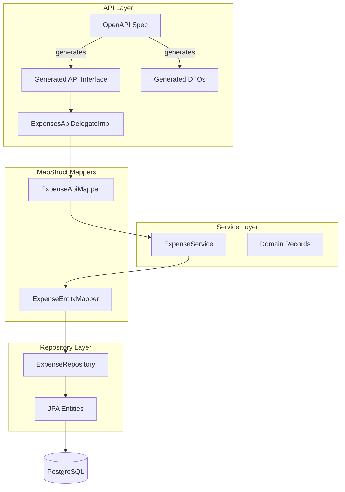
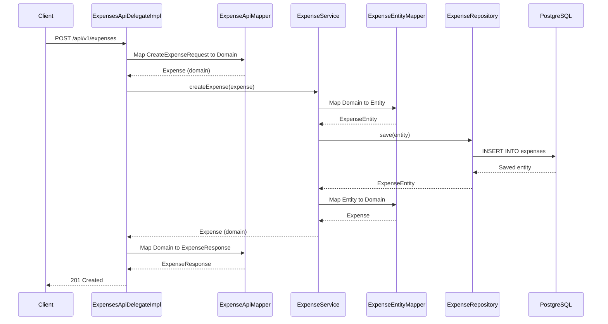

# Kashy API Module

REST API module for managing expenses, built with Spring Boot 4, Java 25, and PostgreSQL.

## Overview

The Kashy API module provides a RESTful API for creating and listing expenses. It follows an **OpenAPI-first** development approach, where the API contract is defined first, and code is generated from the specification.

## Architecture

### Layered Architecture

The module follows a clean layered architecture with clear separation of concerns:



### Request Flow



## API Endpoints

### Create Expense

**POST** `/api/v1/expenses`

Creates a new expense record.

**Request Body:**
```json
{
  "description": "Grocery shopping",
  "dateTime": "2024-01-15T10:30:00Z",
  "amount": 45.99,
  "currency": "EUR",
  "category": "FOOD",
  "notes": "Weekly groceries from supermarket"
}
```

**Response:** `201 Created`
```json
{
  "data": {
    "id": "550e8400-e29b-41d4-a716-446655440000",
    "description": "Grocery shopping",
    "dateTime": "2024-01-15T10:30:00Z",
    "amount": 45.99,
    "currency": "EUR",
    "category": "FOOD",
    "notes": "Weekly groceries from supermarket",
    "createdAt": "2024-01-15T10:30:00Z",
    "updatedAt": "2024-01-15T10:30:00Z"
  }
}
```

### List Expenses

**GET** `/api/v1/expenses`

Retrieves all expenses.

**Response:** `200 OK`
```json
{
  "data": [
    {
      "id": "550e8400-e29b-41d4-a716-446655440000",
      "description": "Grocery shopping",
      "dateTime": "2024-01-15T10:30:00Z",
      "amount": 45.99,
      "currency": "EUR",
      "category": "FOOD",
      "notes": "Weekly groceries from supermarket",
      "createdAt": "2024-01-15T10:30:00Z",
      "updatedAt": "2024-01-15T10:30:00Z"
    }
  ]
}
```

## Data Model

### Expense Domain Model

The core domain model is represented as an immutable record:

```java
public record Expense(
    UUID id,
    String description,
    OffsetDateTime dateTime,
    BigDecimal amount,
    String currency,
    Category category,
    String notes,
    OffsetDateTime createdAt,
    OffsetDateTime updatedAt
)
```

### Category Enum

Expenses are categorized using the following categories:

- `FOOD` - Food and groceries
- `TRANSPORT` - Transportation costs
- `HOUSING` - Housing and rent
- `UTILITIES` - Utility bills
- `ENTERTAINMENT` - Entertainment expenses
- `HEALTHCARE` - Healthcare costs
- `SHOPPING` - Shopping expenses
- `EDUCATION` - Education-related costs
- `TRAVEL` - Travel expenses
- `OTHER` - Other expenses

## Technology Stack

- **Java 25** - Latest Java features including records and pattern matching
- **Spring Boot 4.0.1** - Spring Framework 7 with virtual threads support
- **Spring MVC** - Servlet-based web framework (not reactive)
- **Spring Data JPA** - Data access abstraction
- **PostgreSQL** - Relational database
- **Liquibase** - Database migration tool
- **MapStruct** - Object mapping library
- **Lombok** - Reduces boilerplate code
- **OpenAPI Generator** - Code generation from OpenAPI specs
- **TestContainers** - Integration testing with real databases
- **REST-Assured** - Fluent API for testing REST endpoints
- **JUnit 5** - Testing framework with parameterized tests

## Project Structure

```
kashy-api/
├── src/main/
│   ├── java/io/github/alvarorg14/kashy/api/
│   │   ├── controller/
│   │   │   └── ExpensesApiDelegateImpl.java
│   │   ├── mapper/
│   │   │   ├── ExpenseApiMapper.java
│   │   │   └── ExpenseEntityMapper.java
│   │   ├── model/
│   │   │   ├── domain/
│   │   │   │   ├── Category.java
│   │   │   │   └── Expense.java
│   │   │   └── entity/
│   │   │       └── ExpenseEntity.java
│   │   ├── repository/
│   │   │   └── ExpenseRepository.java
│   │   ├── service/
│   │   │   ├── ExpenseService.java
│   │   │   └── ExpenseServiceImpl.java
│   │   └── KashyApiApplication.java
│   └── resources/
│       ├── application.yaml
│       ├── db/changelog/
│       │   ├── db.changelog-master.yaml
│       │   └── changesets/
│       │       └── 001-create-expenses-table.yaml
│       └── openapi/
│           └── expenses-api.yaml
└── src/test/
    └── java/io/github/alvarorg14/kashy/api/
        ├── config/
        │   └── AbstractIT.java
        ├── controller/
        │   ├── ExpensesApiDelegateImplTest.java
        │   └── ExpensesApiIT.java
        ├── mapper/
        │   ├── ExpenseApiMapperTest.java
        │   └── ExpenseEntityMapperTest.java
        ├── repository/
        │   └── ExpenseRepositoryIT.java
        └── service/
            └── ExpenseServiceTest.java
```

## Layer Responsibilities

| Layer | Responsibility | Model Type |
|-------|---------------|------------|
| **Controller** | HTTP handling, request/response mapping | Generated DTOs |
| **Service** | Business logic, validation | Domain Records |
| **Repository** | Data access, persistence | JPA Entities |
| **Mapper** | Model transformations | MapStruct interfaces |

## Development Workflow

### 1. OpenAPI-First Development

1. Define or update the API contract in `src/main/resources/openapi/expenses-api.yaml`
2. Run `mvn clean compile` to generate API interfaces and DTOs
3. Implement the delegate (`ExpensesApiDelegateImpl`) to handle requests
4. Implement business logic in the service layer
5. Implement data access in the repository layer

### 2. Code Generation

The OpenAPI generator plugin runs automatically during the `generate-sources` phase:

```bash
mvn clean compile
```

Generated code is placed in `target/generated-sources/openapi/`:
- API interfaces: `io.github.alvarorg14.kashy.api.controller.generated`
- DTOs: `io.github.alvarorg14.kashy.api.model`

### 3. Database Migrations

Database schema changes are managed through Liquibase changelogs:

1. Create a new changeset in `src/main/resources/db/changelog/changesets/`
2. The changeset is automatically applied on application startup
3. Changesets are versioned and tracked in the database

## Configuration

### Application Properties

Key configuration in `application.yaml`:

```yaml
spring:
  application:
    name: kashy-api

  threads:
    virtual:
      enabled: true  # Enable virtual threads

  datasource:
    url: ${POSTGRESQL_URL:jdbc:postgresql://localhost:5432/kashy}
    username: ${POSTGRESQL_USERNAME:kashy}
    password: ${POSTGRESQL_PASSWORD:kashy}
  jpa:
    hibernate:
      ddl-auto: validate  # Validate schema, don't auto-create
  liquibase:
    change-log: classpath:db/changelog/db.changelog-master.yaml
    enabled: true
```

### Environment Variables

| Variable | Default | Description |
|----------|---------|-------------|
| `POSTGRESQL_URL` | `jdbc:postgresql://localhost:5432/kashy` | PostgreSQL connection URL |
| `POSTGRESQL_USERNAME` | `kashy` | Database username |
| `POSTGRESQL_PASSWORD` | `kashy` | Database password |

### Virtual Threads

The application uses virtual threads (Project Loom) for request handling, allowing efficient handling of blocking I/O operations without the overhead of platform threads.

## Testing

### Unit Tests

- **Service Tests**: Test business logic with mocked dependencies using Mockito
- **Mapper Tests**: Verify correct mapping between DTOs, domain models, and entities
- **Controller Tests**: Test delegate implementation with mocked service layer

### Integration Tests

- **Repository Tests**: Use TestContainers to test against a real PostgreSQL instance
- **API Tests**: Use REST-Assured to test full HTTP request/response cycle with real database

### Test Infrastructure

- **AbstractIT**: Base class for integration tests providing TestContainers configuration
- **TestContainers**: Provides real PostgreSQL database for integration tests
- **REST-Assured**: Fluent API for testing REST endpoints

### Running Tests

```bash
# Run all tests
mvn test

# Run only unit tests
mvn surefire:test

# Run only integration tests
mvn failsafe:integration-test
```

## Building and Running

### Prerequisites

- Java 25
- Maven 3.9+
- PostgreSQL 16+ (or Docker for TestContainers)

### Build

```bash
mvn clean install
```

### Run

```bash
mvn spring-boot:run
```

The API will be available at `http://localhost:8080/api/v1/expenses`

## API Documentation

The OpenAPI specification is available at:
- **Spec File**: `src/main/resources/openapi/expenses-api.yaml`
- **Swagger UI**: Available when SpringDoc OpenAPI is added (future enhancement)

## Error Handling

The API provides structured error responses following the OpenAPI specification:

```json
{
  "errors": [
    {
      "code": "VALIDATION_ERROR",
      "reason": "Description cannot be null or blank. Please provide a valid description.",
      "datetime": {
        "value": "2024-01-15T10:30:45.123",
        "timezone": "UTC"
      }
    }
  ]
}
```

Error responses include:
- **Error code**: Machine-readable error type (e.g., `VALIDATION_ERROR`, `INTERNAL_SERVER_ERROR`)
- **Reason**: Human-readable description with suggested action
- **Datetime**: Timestamp with timezone information
- **Root causes**: Optional detailed technical information for debugging

## Future Enhancements

- [ ] Add global exception handler for consistent error responses
- [ ] Add filtering and pagination to list expenses endpoint
- [ ] Add update and delete endpoints
- [ ] Add expense search functionality
- [ ] Add Swagger UI for interactive API documentation
- [ ] Add API versioning support
- [ ] Add authentication and authorization
- [ ] Add expense analytics endpoints
